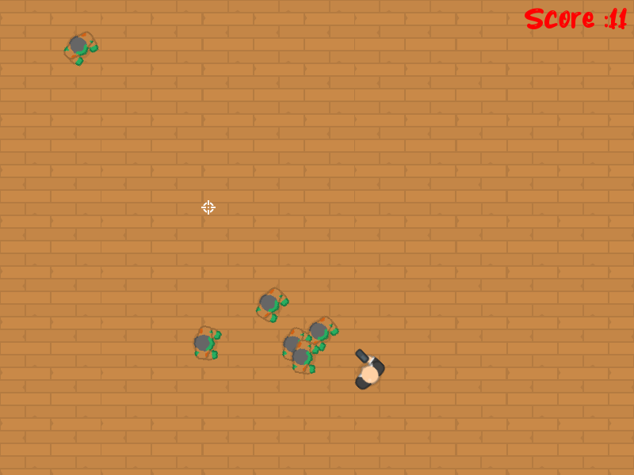

# Top Down Shooter SFML

Top Down Shooter is an engaging and fast-paced 2D shooting game developed using the SFML framework. In this game, players navigate a character from a top-down perspective, aiming to defeat waves of enemies and achieve high scores. The game features smooth controls, dynamic gameplay, and visually appealing graphics.

## Screenshots

## Addons
* [SFML](https://www.sfml-dev.org) - page of SFML project
* [Font](https://www.dafont.com/juniory.font) - font
* [Tiles/Images](https://kenney.nl) - kenney.nl
* [Github repo](https://github.com/challacade/udemy-love2d/tree/master/TopDownShooter) - inspiration
* [Pistol SFX](https://opengameart.org/content/chaingun-pistol-rifle-shotgun-shots) - pistol sfx(opengameart)
* [Pop SFX](https://opengameart.org/content/3-pop-sounds) - popping sfx(opengameart)
* [youtube](https://youtu.be/iBdX2wcM8ag) - gameplay 
